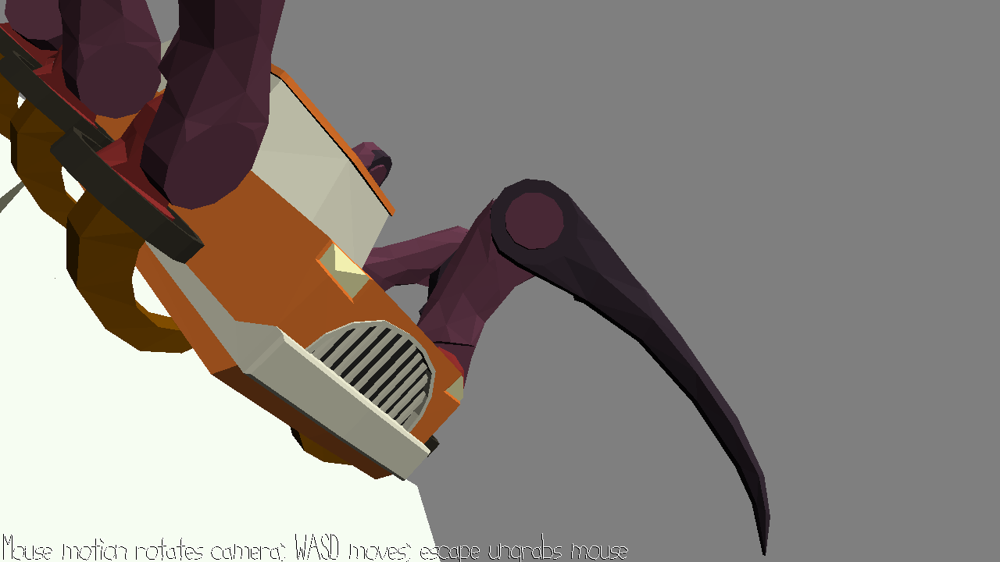

# Escape Death

Author: Pablo Wilson

Design: Nothing, sorry. This past week has been incredbily stressful with exams, coding challenges, and interviews, so I was not able to find the proper amount of time this needed. I wanted it to be a fully text escape room where you had to explore your options to find clues to escape, but a wrong answer would lead to death (restart). The plan was to have a simple save file so you could track multiple clues over the course of runs, rogue-like style, so you would need to die a couple times before you could win.

Text Drawing: none sorry:/

Screen Shot:

How To Play: 

Sources: 

This game was built with [NEST](NEST.md).

